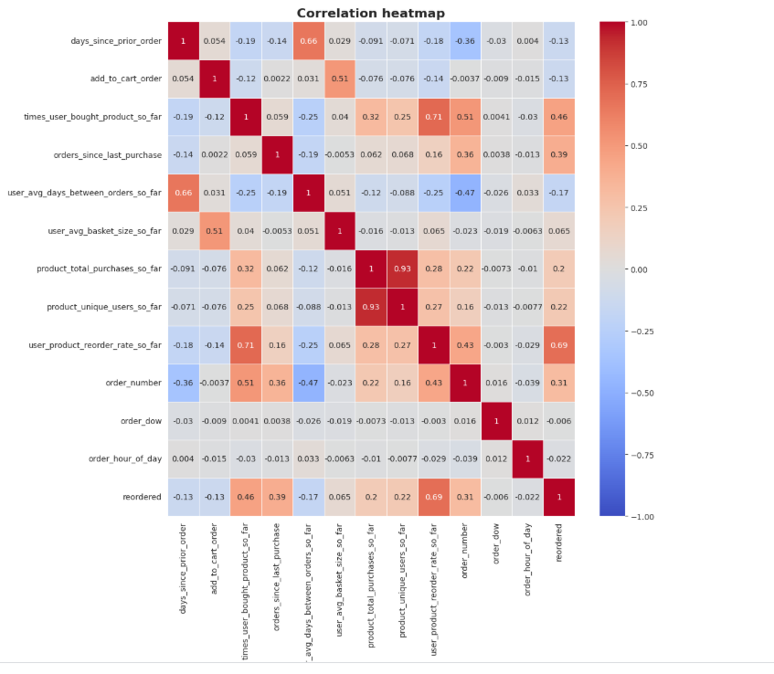
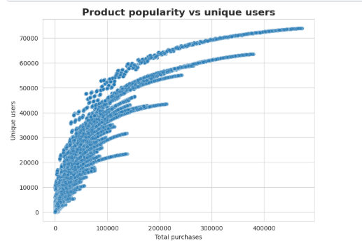
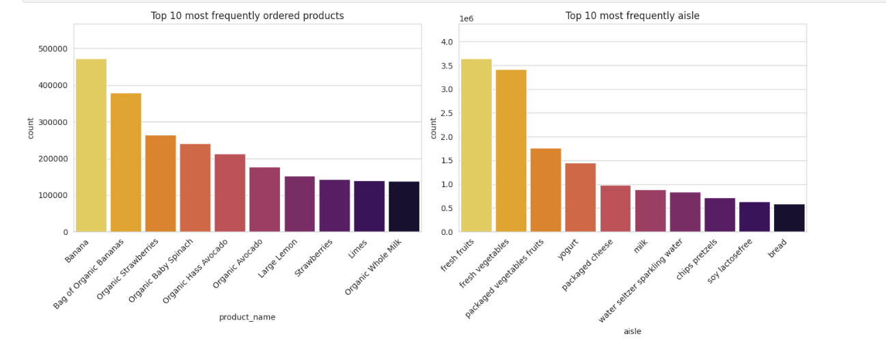
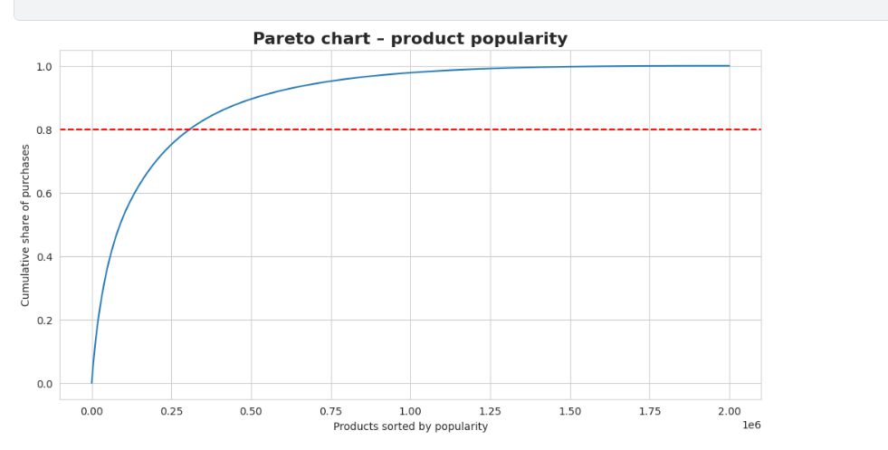
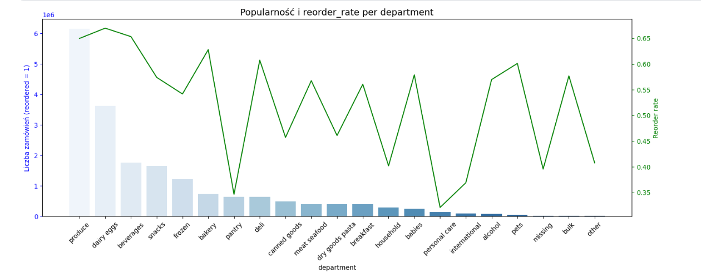
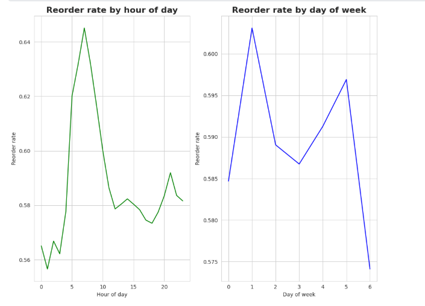
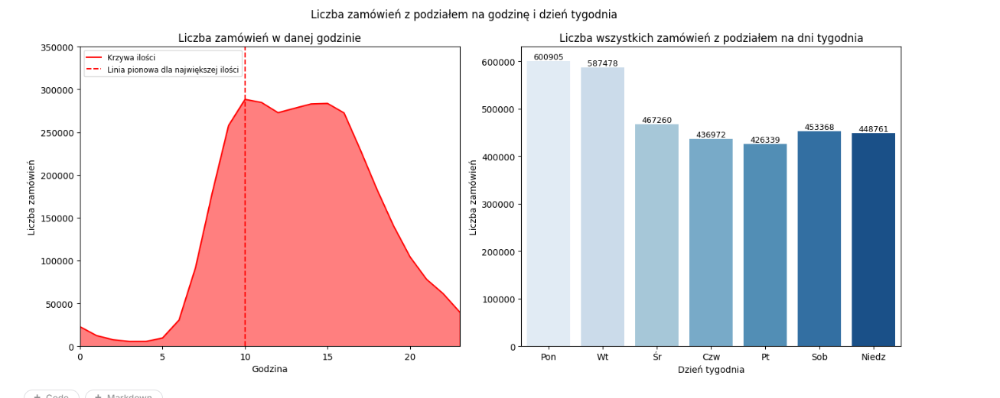
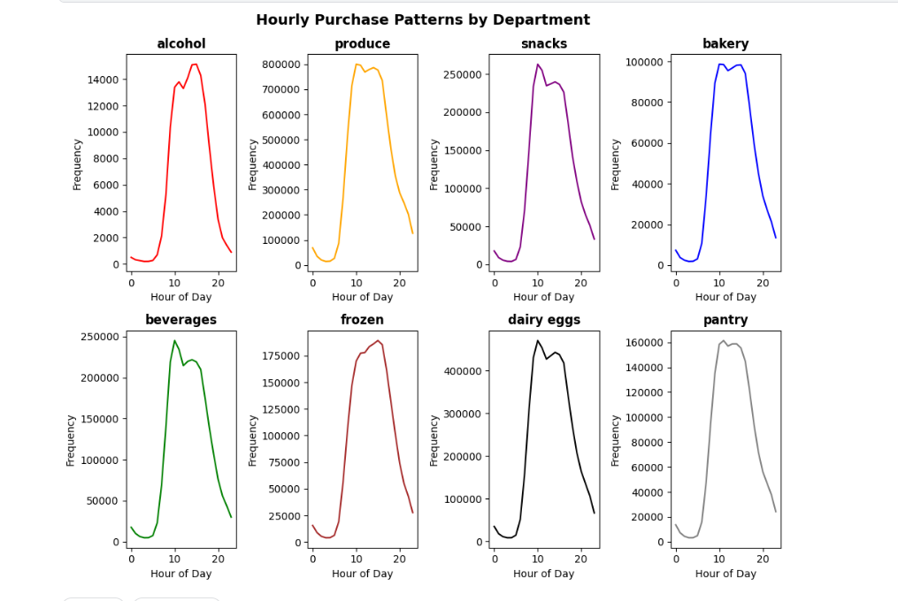

# 🛒 Instacart Market Basket Analysis

Machine Learning project focused on predicting product reorders using historical purchase behavior.

The goal of this project is to build a feature-engineered dataset and train a model capable of predicting whether a product will be reordered (binary classification problem).

---

## 📌 Project Overview

This project includes:

- Advanced Feature Engineering (time-aware, no data leakage)
- Rolling window aggregations
- User-level, Product-level and User-Product interaction features
- Correlation analysis
- Exploratory Data Analysis
- Preparation for machine learning modeling

Target variable: 
reordered (0 = first purchase, 1 = reorder)

---

# 📊 Exploratory Data Analysis

## 🔥 Correlation Heatmap

Shows relationships between engineered features and the target variable.

---

## 📈 Product Popularity

Distribution of total product purchases.

---

## 🥇 Top 10 Most Purchased Products

---

## 📊 Pareto Analysis (80/20 Rule)

Shows how a small group of products generates most purchases.

---

## 🛍️ Product Popularity Distribution

---

## 🔁 Reorder Rate Distribution

---

## 📦 Basket Size Distribution

---

## ⏰ Hourly Purchase Distribution

Shows when users most frequently place orders.

---

# 🧠 Feature Engineering

The project uses time-aware feature engineering to avoid data leakage.

Key features include:

### 👤 User-level Features
- `user_avg_days_between_orders_so_far`
- `user_avg_basket_size_so_far`
- `order_number`

### 📦 Product-level Features
- `product_total_purchases_so_far`
- `product_unique_users_so_far`

### 🔄 User-Product Interaction Features
- `times_user_bought_product_so_far`
- `orders_since_last_purchase`
- `user_product_reorder_rate_so_far`

All rolling features were calculated using:
ROWS BETWEEN UNBOUNDED PRECEDING AND 1 PRECEDING

This ensures:
- No future information leakage
- Real-world prediction simulation
- Proper temporal validation

---

# 📈 Feature Importance Insight

Strongest correlated features with `reordered`:

- `times_user_bought_product_so_far`
- `orders_since_last_purchase`
- `user_product_reorder_rate_so_far`
- `product_unique_users_so_far`

Weak but usable:
- `order_dow`
- `order_hour_of_day`

---

# 🛠️ Technologies Used

- Python
- DuckDB (SQL feature engineering)
- Pandas
- Matplotlib / Seaborn
- Scikit-learn
- Parquet files

---

# 🚀 Future Improvements

- Time-based train/test split
- Gradient Boosting (LightGBM / XGBoost)
- SHAP feature importance analysis
- Hyperparameter tuning
- Cross-validation with temporal awareness

---

# 📂 Project Structure

Instacart-Market-Basket-Analysis/
│
├── data/
├── notebooks/
├── photos/
├── parquet_files/
├── src/
├── models/
├── README.md
└── requirements.txt

